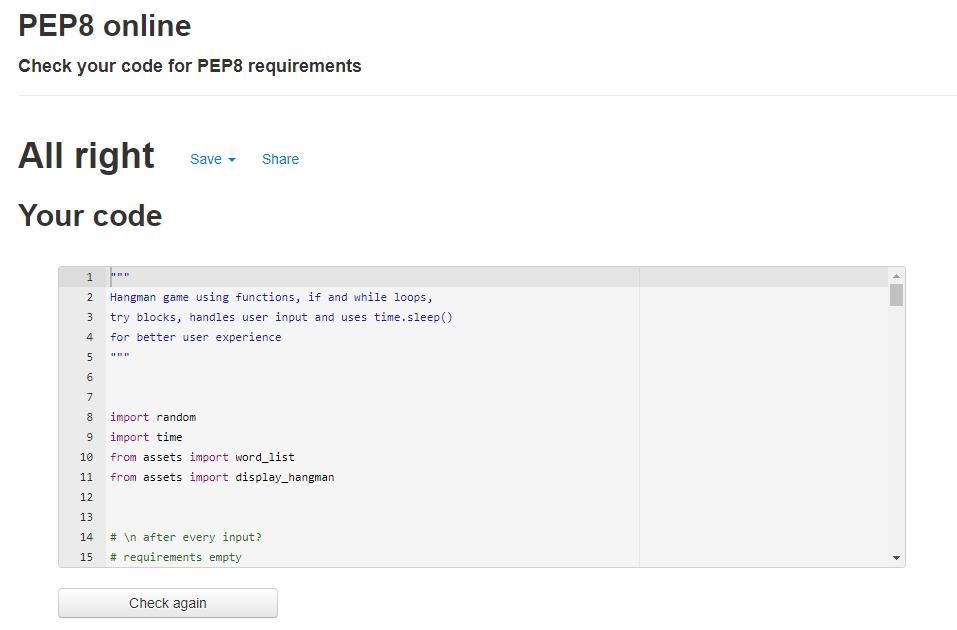

# Hangman

[Live link](https://hangman25.herokuapp.com/)

This is a simple hangman game project, built with python, deployed on Heroku and is strictly terminal-based for user interaction.
This project is designed for people who love puzzles, maybe bringing them back childhood memories, even tho it being somehow offensive, it's just a fun, thinking game.
And hangman is a word-guessing puzzle where you are given a secret word, knowing only the length of it by underscores. And by guessing out some letters, try to figure out the secret word before the man hangs, when each wrong attempt adds a part of the man's body to the gallows.

# Features

# Technology 

# Testing

Testing for this project has been done manually and thoroughly by me and some people that I asked to try it out, trying to break the code in every possible way, but failed. All feedback received was positive and no errors encountered when playing, other than not guessing the word :). However, it does not work on mobile.

## Code validation

No errors found when running the code through pep8 online checker.

# Bugs

The underscores on Heroku did not have any spacing between them

# Local Development

## Forking and Cloning

## Forking a repository
### A fork is a copy of a repository. Forking a repository allows you to freely experiment with changes without affecting the original project.
1. On GitHub.com, navigate to the EddieStn/hangman repository.
2. In the top-right corner of the page, click Fork.

## Cloning your forked repository
### Right now, you have a fork of the hangman repository, but you do not have the files in that repository locally on your computer.
1. On GitHub.com, navigate to your fork of the hangman repository.
2. Above the list of files, click Code.
3. Copy the URL for the repository.
4. Open Git Bash.
5. Change the current working directory to the location where you want the cloned directory.
6. Type git clone, and then paste the URL you copied earlier. It will look like this, with your GitHub username instead of YOUR-USERNAME:
   - git clone https://github.com/YOUR-USERNAME/hangman
7. Press Enter. Your local clone will be created.

# Deployment
### The site was deployed to Heroku. The steps to deploy are as follows:

* Log in to Heroku Heroku
* Click New
* Give the app a name and choose the region
* Click on settings first and set the Reveal Config Vars
* Key = PORT, Value = 8000
* Add python and nodeJs as buildpacks, making sure that python is on top
* Click Deploy at the top to go to the Deployment settings
* Choose GitHub as the deployment method
* Search for your app and connect
* Use Automatic deploys if you would like a new build when changes are pushed to GitHub from Gitpod
* Use Manual deploy for a new build every time this button is clicked.
* Once completed click View App.

The live link can be found here - (https://hangman25.herokuapp.com/)

# Credits

# Acknowledgements

* Many thanks to Chris Quinn, my mentor, for guidance and for his brilliant ideas

## Websites that thought me python

* [code with mosh](https://codewithmosh.com/)
* 
