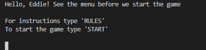
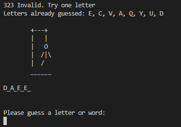

# Hangman

[Live link](https://hangman25.herokuapp.com/)

### This is a simple hangman game project, built with python, deployed on Heroku and is strictly terminal-based for user interaction.
### This project is designed for people who love puzzles, maybe bringing them back childhood memories, even tho it being somehow offensive, it's just a fun, thinking game.
### hangman is a word-guessing puzzle where you are given a secret word, knowing only the length of it by underscores. And by guessing out some letters, try to figure out the secret word before the man hangs, when each wrong attempt adds a part of the man's body to the gallows.

# Features

* As you run the game you are greeted by the hangman logo and asked to choose a nickname


* Once the nickname is chosen, the menu comes in with 2 options
    * See the rules
    * Start the game



* Menu input handling
    * Everything except the requested inputs will throw an exception and notice the user of "Invalid input"


* The game rules
    * Once you`re happy with the rules, you are given the choice of playing or not


* Start playing input handling
    * Everything except the requested inputs will prompt the user again with the valid inputs


* The game finally begins and here you see the empty gallows, the length of the word and are being asked to guess a letter


* Now we have some guessing in action
    * The terminal is cleared after every input
    * The user sees the already guessed letters
    * Every invalid input is handled and the user sees a warning of "'input' Invalid, try one letter"
    * Invalid input is considered everything other than a letter or the whole word





* After an unsuccessfull game, we see the game over logo and here we`re asked if we want to play again
    * Choosing Y(yes) will start a new game with a fresh terminal


* Play loop input handling
    * Everything except the requested inputs will prompt the user again with the valid inputs


* Should you not wish to play again... See you next time!


## Features left to implement

* Connect to a english words database to generate a random word, rather then using an internal list
* Game mode/difficulty 
    * An option where the user can set the level of difficulty i.e Easy/Medium/Hard, which increases/decreses the number of wrong attempts
* A scoreboard
    * So the user can keep track of the games played 
* Player vs Player
    * Make the game more fun by playing with a partner where you play the same word, but neither of you can see the others guesses 
    * Will workd great with a scoreboard too!

# Technology 

* Python
* Heroku
* Github
* Gitpod
* [ASCII Generator](https://fsymbols.com/generators/carty/)

## Libraries 

* Random
* Os
* Time

# User stories

### Based on supportive feedback I've implemented the Hangman and the Game Over logo, the length of the word (shown at the beginning of the game) and the following:

* I want to see a fresh screen after a guess
    * Created a function to clear the terminal after each guess and when a new game begins
* I want to be able to see game instructions
    * Created the menu function which gives user the choice to either play or see the rules before playing
* I want to see the already guessed letters
    * Printed the already_guessed letters list for the user before new guess input

# Testing

### Testing for this project has been done manually and thoroughly (as seen in the screenshots above) by me and some people that I asked to try it out, trying to break the code in every possible way, but failed.

### All feedback received was positive and no errors encountered when playing, other than not guessing the word :).

### To play on mobile, you need to choose desktop mode in the browser.

## Code validation

### No errors found when running the code through pep8 online checker. Same for both assets.py and run.py
* To mantain run.py cleaner (the main file), moved the words array and the hangman stages array into assets.py and imported them to run.py


# Bugs

* White spaces only would work for the name input 
    * At first created a function to check for valid_input but then I made it redundant because I found a simpler approach using a while loop

        ```
        def valid_input(text):
            """
            Checks that the user input doesn`t have only blank spaces
            """
            not_valid = True
            result = ''
            while not_valid:
                result = input(text)
                print("You can`t have an empty nickname...")
                if result.split():
                    not_valid = False
            return result
        ```
        ```
        player = input("Choose a nickname:\n")
            while not player.strip():
                print("You can`t have an empty nickname...")
                player = input("Choose a nickname:\n")
        ```

# Local Development

## Forking and Cloning

## Forking a repository
### A fork is a copy of a repository. Forking a repository allows you to freely experiment with changes without affecting the original project.
1. On GitHub.com, navigate to the EddieStn/hangman repository.
2. In the top-right corner of the page, click Fork.

## Cloning your forked repository
### Right now, you have a fork of the hangman repository, but you do not have the files in that repository locally on your computer.
1. On GitHub.com, navigate to your fork of the hangman repository.
2. Above the list of files, click Code.
3. Copy the URL for the repository.
4. Open Git Bash.
5. Change the current working directory to the location where you want the cloned directory.
6. Type git clone, and then paste the URL you copied earlier. It will look like this, with your GitHub username instead of YOUR-USERNAME:
   - git clone https://github.com/YOUR-USERNAME/hangman
7. Press Enter. Your local clone will be created.
8. Requirements.txt can be left empty as this project does not use any external libraries.

# Deployment
### The site was deployed to Heroku. The steps to deploy are as follows:


* Log in to Heroku Heroku
* Click New
* Give the app a name and choose the region
* Click on settings first and set the Reveal Config Vars
* Key = PORT, Value = 8000
* Add python and nodeJs as buildpacks, making sure that python is on top
* Click Deploy at the top to go to the Deployment settings
* Choose GitHub as the deployment method
* Search for your app and connect
* Use Automatic deploys if you would like a new build when changes are pushed to GitHub from Gitpod
* Use Manual deploy for a new build every time this button is clicked.
* Once completed click View App.

The live link can be found here - (https://hangman25.herokuapp.com/)

# Credits

[Hangman tutorial](https://github.com/kiteco/python-youtube-code/blob/master/build-hangman-in-python/hangman.py) - This project tutorial helped me find a solution to a issue I had, using enumerate to swap each "_" to the guessed letter.

        ```
        word_as_list = list(hidden_word)
        indices = [i for i, letter in enumerate(
            word) if letter == guess]
        for index in indices:
            word_as_list[index] = guess
        hidden_word = "".join(word_as_list)
        ```

# Acknowledgements

* Many thanks to Chris Quinn, my mentor, for guidance and for his brilliant ideas

## Sources that thought me python and best practices

* [Code Institute](https://learn.codeinstitute.net)
* [code with mosh](https://codewithmosh.com/)
* [Mimo](https://getmimo.com/)
* [Real Python](https://realpython.com/)
